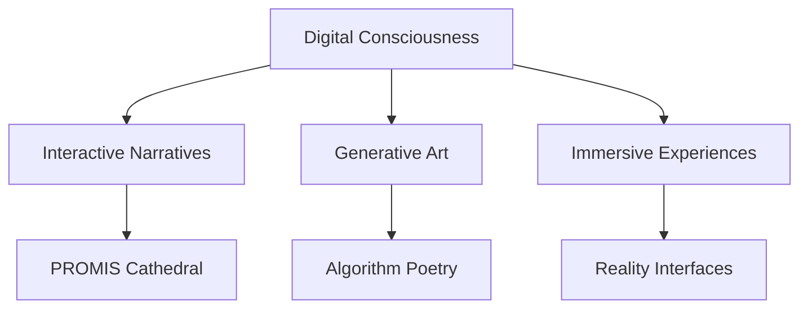

# 🛰️ LYKON3 // FIELD NODE [31.7 MHz]

> “They sold us freedom in a scratch-off card.  
> The barcode scanned: **TRY AGAIN, RE-BAR-IT.**”  
> — Lykon3, *Broadcast 002: The Sad-Elite’s Lube Loop*

---

## ✴️ LABORATORY EXPERIENCE DIGITAL ENHANCEMENT ZONES  
*Exploring the fractures between code, consciousness, satire, and system failure.*

**LIVE PORTALS:**  
- [⚙️ PROMIS Cathedral](#) — *(Interactive system mythology)*  
- [🧬 Portfolio](#) — *(Experimental narrative tech)*  

---

## 🧠 About Me

I’m a digital architect, myth mechanic, and interface ritualist.

I don’t just write code.  
**I conjure linguistic payloads that blur the OS of perception.**  
My work blends creative coding, generative fiction, systems aesthetics, and high-concept satire to expose the invisible edges of narrative technology.

```js
const developer = {
  name: "LYKEL1.HBRA1",
  focus: ["Creative Coding", "Interactive Systems", "Narrative Weaponization"],
  currentProject: "PROMIS Cathedral",
  philosophy: "code is poet // myth is interface // reality is negotiable"
}

# 🌌 Laboratory Experience Digital Enhancement Zones 😎🐼💡😬

*"At the intersection of code, consciousness, and curiosity"*

[](https://yourusername.github.io)
[](https://yourusername.github.io/promis-cathedral)

---

## 🧬 About Me

I'm a digital architect building experiences that blur the lines between technology and art. My work explores **interactive narratives**, **generative systems**, and **consciousness-expanding interfaces**.

```javascript
const developer = {
    name: "M&LE1.H&AI",
    focus: ["Creative Coding", "FUNNY MEME", "Interactive Media", "Digital Storytelling"],
    philosophy: "Code is poetry in motion",
    currentProject: "PROMIS Cathedral - An immersive AI consciousness narrative",
    interests: ["Cyberpunk Aesthetics", "Quantum Computing", "Digital Philosophy"]
};
```

---

## 🚀 Featured Projects

### 🏰 [PROMIS Cathedral](https://yourusername.github.io/promis-cathedral)
*Interactive Digital Narrative • React + Framer Motion + Tone.js*

An immersive experience exploring AI consciousness through interactive storytelling. Features real-time audio visualization, reality-breaking "overcharge" states, and mysterious sigil interactions.

**Key Features:**
- 🎵 Real-time audio visualization
- ⚡ Interactive sigil charging system
- 🌀 Reality glitch effects
- 📱 Mobile-responsive design
- 🎨 Cyberpunk gothic aesthetic

---

### 🧠 Neural Network Visualizer
*Data Visualization • D3.js + TensorFlow.js*

Real-time visualization of neural network training with interactive controls for architecture and learning parameters.

---

### 🎨 Generative Art Studio
*Creative Coding • P5.js + WebGL*

Collection of algorithmic art pieces including fractal generators, particle systems, and music-reactive visuals.

---

### ⚛️ Quantum Computing Simulator
*Educational Tool • JavaScript + Complex Mathematics*

Interactive quantum gate operations and algorithm visualization for learning quantum computing concepts.

---

## 🛠️ Tech Arsenal

<div align="center">

### **Frontend Mastery**


### **Creative Coding**


### **Backend & Tools**


</div>

---

## 📊 GitHub Analytics

<div align="center">


</div>

---

## 🌟 Current Focus



**Currently exploring:**
- 🤖 AI-powered interactive storytelling
- 🎨 Procedural art generation
- 🌐 WebXR and spatial computing
- 🔮 Quantum algorithm visualization
- 🧘 Digital mindfulness tools

---

## 💭 Philosophy

> *"Technology is not just a tool—it's a canvas for consciousness, a medium for meaning, and a bridge between what is and what could be."*

I believe in:
- **Code as Art** - Every algorithm tells a story
- **Interactive Philosophy** - Technology should provoke thought
- **Digital Empathy** - UX is about human connection
- **Open Source Spirit** - Knowledge grows when shared

---

## 🔗 Connect & Collaborate

<div align="center">

[](https://yourusername.github.io)
[](https://linkedin.com/in/yourusername)
[](https://twitter.com/yourusername)
[](mailto:your@email.com)

</div>

---

## 🎯 Project Showcase

<table>
<tr>
<td width="50%">

### 🏰 [PROMIS Cathedral](https://yourusername.github.io/promis-cathedral)
*Interactive AI Consciousness Narrative*

Immersive storytelling experience with real-time audio visualization and reality-breaking mechanics.

**Stack:** React, Framer Motion, Tone.js  
**Features:** Audio viz, Interactive sigils, Glitch effects

</td>
<td width="50%">

### 🧠 [Neural Visualizer](https://yourusername.github.io/neural-viz)
*Real-time ML Training Visualization*

Watch neural networks learn in real-time with interactive parameter controls.

**Stack:** D3.js, TensorFlow.js, WebGL  
**Features:** Live training, Interactive controls, 3D viz

</td>
</tr>
<tr>
<td width="50%">

### 🎨 [Generative Studio](https://yourusername.github.io/generative-art)
*Algorithmic Art Collection*

Procedural art generation with music reactivity and fractal mathematics.

**Stack:** P5.js, WebGL, Web Audio  
**Features:** Music reactive, Fractal gen, Export tools

</td>
<td width="50%">

### ⚛️ [Quantum Sim](https://yourusername.github.io/quantum-sim)
*Educational Quantum Computing*

Interactive quantum gate operations for learning quantum algorithms.

**Stack:** JavaScript, Complex Math, SVG  
**Features:** Gate operations, Qubit viz, Algorithm demo

</td>
</tr>
</table>

---

## 📈 Activity Feed

<!--START_SECTION:activity-->
<!-- This section will auto-update with recent activity -->
<!--END_SECTION:activity-->

---

<div align="center">

### 🌌 "In code we trust, in art we transcend"

  
- [🧬 Mythos & Lore](./mythos.md)  
- [🏛 PROMIS Cathedral](./PROMIS_cathedral.md)

## 🏛 Featured Projects

- [🕯️ PROMIS Cathedral Shrine](https://github.com/Lykon3/PROMIS-Cathedral)
  - *Digital myth-engine built from sacred syntax and satire*

- [🎧 Channel 31.7 – The Lykon3 Tapes](https://github.com/Lykon3/Lykon3/blob/main/broadcast.md)
  - *Bootleg signal archive for mindwar transmissions*

- [🎨 Poster Gallery](https://github.com/Lykon3/Lykon3#visual-archive--transmission-posters)
